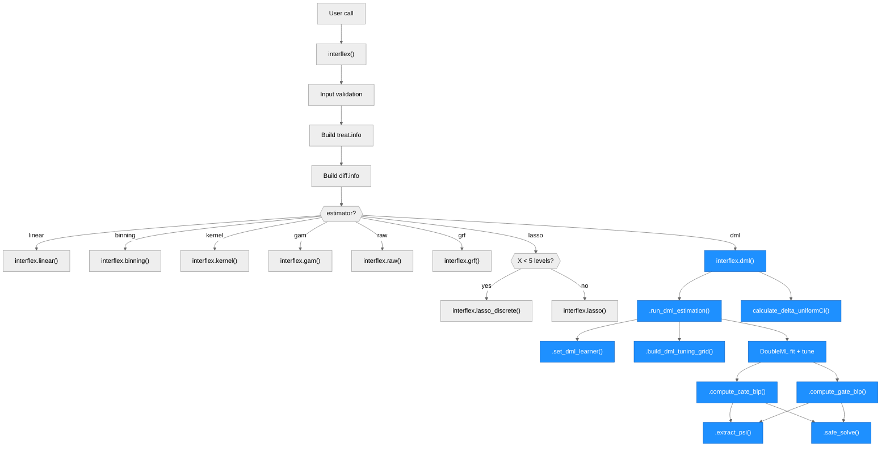
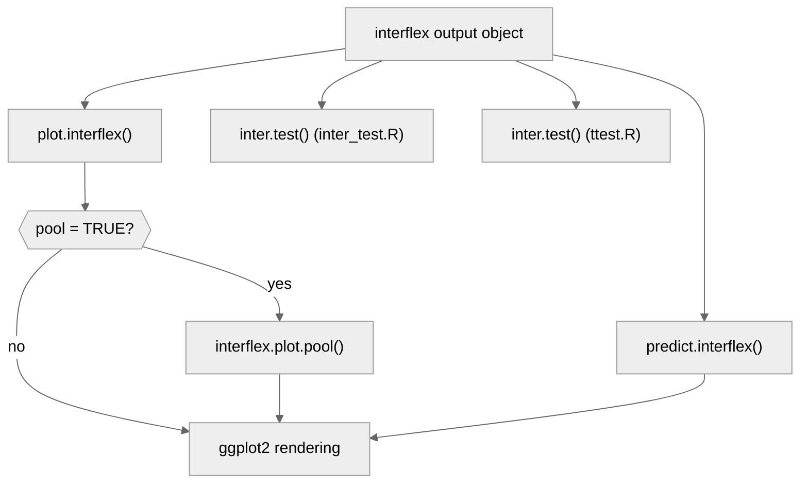
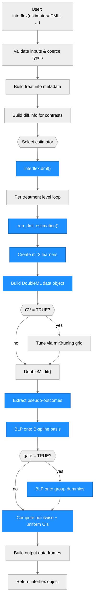

# Architecture — interflex

> Updated by scribe for run `py-to-r-dml-001` on 2026-03-16.
> Previous runs: `interflex-dml-refactor-20260315-212459` (2026-03-15 — utils.R refactoring), `merge-bs-dml-20260316-032034` (2026-03-16 — merge bs features into dml), `py-to-r-dml-001` (2026-03-16 — Python-to-R DML migration).

## Overview

**interflex** is an R package (v1.3.5) for diagnosing and visualizing multiplicative interaction models. It estimates non-linear marginal effects of a treatment (D) on an outcome (Y) across values of a moderator (X), supporting both discrete and continuous treatments. The package provides eight estimation strategies (linear, binning, kernel, GAM, raw, GRF, DML, lasso), unified behind a single `interflex()` entry point. Key external dependencies include ggplot2 (plotting), mgcv (GAM), grf (causal forests), glmnet (lasso/ridge), DoubleML/mlr3 (DML estimation), and Rcpp/RcppArmadillo (C++ linear algebra stubs).

---

## Module Structure

```mermaid
%%{init: {'theme': 'neutral'}}%%
graph TD
    subgraph API["API Layer"]
        IFX["interflex.R — router"]
        PLT["plot.R — S3 plot method"]
        PRD["predict.R — S3 predict"]
        TST["inter_test.R — t-tests"]
        TST2["ttest.R — t-tests (bs)"]
    end

    subgraph Estimators["Estimator Layer"]
        LIN["linear.R"]
        BIN["binning.R"]
        KER["kernel.R"]
        GAM["gam.R"]
        RAW["raw.R"]
        GRF["grf.R"]
        DML["DML.R — pure R DML"]
        LAS["lasso.R"]
        LSD["lasso_discrete.R"]
    end

    subgraph DMLHelpers["DML Internal Helpers"]
        SDL[".set_dml_learner()"]
        MRF[".map_rf_params()"]
        MBP[".map_boosting_params()"]
        MNP[".map_nn_params()"]
        BTG[".build_dml_tuning_grid()"]
        CCB[".compute_cate_blp()"]
        CGB[".compute_gate_blp()"]
        EPS[".extract_psi()"]
        SSV[".safe_solve()"]
        RDE[".run_dml_estimation()"]
    end

    subgraph DMLSub["DML Sub-Estimators"]
        CME_I["estimate_cme_irm.R"]
        CME_P["estimate_cme_plr.R"]
        GTE_I["estimate_gte_irm.R"]
        GTE_P["estimate_gte_plr.R"]
    end

    subgraph Output["Output Layer"]
        PPL["plot_pool.R — pooled plots"]
    end

    subgraph Utils["Utilities"]
        UTL["utils.R — shared helpers"]
        UNI["uniform.R — uniform CI"]
        VCL["vcluster.R — cluster vcov"]
    end

    IFX --> LIN
    IFX --> BIN
    IFX --> KER
    IFX --> GAM
    IFX --> RAW
    IFX --> GRF
    IFX --> DML
    IFX --> LAS
    IFX --> LSD
    PLT --> PPL
    LAS --> CME_I
    LAS --> CME_P
    LAS --> GTE_P
    LSD --> CME_I
    LSD --> GTE_I
    LIN --> UTL
    BIN --> UTL
    KER --> UTL
    GRF --> UTL
    DML --> UTL
    LAS --> UTL
    LSD --> UTL
    RAW --> UTL
    BIN --> VCL
    LIN --> VCL
    KER --> VCL
    DML --> SDL
    DML --> RDE
    RDE --> SDL
    RDE --> CCB
    RDE --> CGB
    RDE --> BTG
    CCB --> EPS
    CGB --> EPS
    CCB --> SSV
    CGB --> SSV
    SDL --> MRF
    SDL --> MBP
    SDL --> MNP
    DML --> UNI

    style DML fill:#1e90ff,stroke:#1565c0,color:#fff
    style SDL fill:#1e90ff,stroke:#1565c0,color:#fff
    style MRF fill:#1e90ff,stroke:#1565c0,color:#fff
    style MBP fill:#1e90ff,stroke:#1565c0,color:#fff
    style MNP fill:#1e90ff,stroke:#1565c0,color:#fff
    style BTG fill:#1e90ff,stroke:#1565c0,color:#fff
    style CCB fill:#1e90ff,stroke:#1565c0,color:#fff
    style CGB fill:#1e90ff,stroke:#1565c0,color:#fff
    style EPS fill:#1e90ff,stroke:#1565c0,color:#fff
    style SSV fill:#1e90ff,stroke:#1565c0,color:#fff
    style RDE fill:#1e90ff,stroke:#1565c0,color:#fff
```

> One unified diagram. Subgraph layers group related modules. Blue fill = modified/created in this run.

### Module Reference

| Module / File | Layer | Purpose | Key Exports | Changed |
| --- | --- | --- | --- | --- |
| `R/interflex.R` | API | Main entry point; validates inputs, builds `treat.info`/`diff.info`, routes to estimator | `interflex()` | no |
| `R/plot.R` | API | S3 `plot.interflex()` method; renders marginal effect plots with density/histogram overlays | `plot.interflex()` | no |
| `R/predict.R` | API | S3 `predict.interflex()` method; computes predicted marginal effects at new X values | `predict.interflex()` | no |
| `R/inter_test.R` | API | Post-estimation t-test for difference in marginal effects (dml style) | `inter.test()` | no |
| `R/ttest.R` | API | Post-estimation t-test for difference in marginal effects (bs copy) | `inter.test()` | no |
| `R/linear.R` | Estimator | Linear interaction model with delta/bootstrap/simulation variance | `interflex.linear()` | no |
| `R/binning.R` | Estimator | Binning estimator: splits X into bins, estimates within-bin effects | `interflex.binning()` | no |
| `R/kernel.R` | Estimator | Kernel estimator: local polynomial regression with bandwidth selection | `interflex.kernel()` | no |
| `R/gam.R` | Estimator | GAM estimator via `mgcv::gam()` with 3D visualization | `interflex.gam()` | no |
| `R/raw.R` | Estimator | Raw data scatter plots with LOESS smoothing | `interflex.raw()` | no |
| `R/grf.R` | Estimator | Generalized random forests via `grf::causal_forest()` | `interflex.grf()` | no |
| `R/DML.R` | Estimator | **Pure R DML via DoubleML + mlr3** (formerly Python/reticulate) | `interflex.dml()` | **yes — rewritten** |
| `R/lasso.R` | Estimator | Lasso/ridge DML for continuous moderators; calls CME/GTE sub-estimators | `interflex.lasso()` | no |
| `R/lasso_discrete.R` | Estimator | Lasso/ridge DML for discrete moderators (<5 unique X values) | `interflex.lasso_discrete()` | no |
| `R/estimate_cme_irm.R` | DML Sub | CME estimation via AIPW-Lasso (binary treatment, IRM) | `estimateCME_IRM()` | no |
| `R/estimate_cme_plr.R` | DML Sub | CME estimation via PO-Lasso (continuous treatment, PLRM) | `estimateCME_PLR()` | no |
| `R/estimate_gte_irm.R` | DML Sub | Group treatment effects via AIPW-Lasso (binary treatment, discrete X) | `estimateGTE_IRM()` | no |
| `R/estimate_gte_plr.R` | DML Sub | Group treatment effects via PO-Lasso (continuous treatment, discrete X) | `estimateGTE_PLR()` | no |
| `R/plot_pool.R` | Output | Pooled multi-treatment plot with overlaid CIs | `interflex.plot.pool()` | no |
| `R/utils.R` | Utils | Shared internal helpers: treat.info extraction, density, histograms | (internal: dot-prefixed) | no |
| `R/uniform.R` | Utils | Uniform confidence interval quantiles via bootstrap/delta method | `calculate_uniform_quantiles()`, `calculate_delta_uniformCI()` | no |
| `R/vcluster.R` | Utils | Cluster-robust variance-covariance matrix computation | `vcovCluster()` | no |
| `R/RcppExports.R` | Utils | Auto-generated Rcpp bindings (do not edit) | `rcpparma_hello_world()`, etc. | no |
| `DESCRIPTION` | Config | Package metadata; Imports, Depends, LinkingTo | N/A | **yes** |
| `NAMESPACE` | Config | Export pattern, S3 methods, importFrom declarations | N/A | **yes** |
| `inst/python/dml.py` | ~~Python~~ | ~~DML estimation engine~~ | ~~`marginal_effect_for_treatment()`~~ | **deleted** |

---

## Function Call Graph

### Main Pipeline

### Output Pipeline

### Function Reference

| Function | Defined In | Called By | Calls | Changed | Purpose |
| --- | --- | --- | --- | --- | --- |
| `interflex()` | `R/interflex.R` | user (exported) | all estimators | no | Validate inputs, build metadata, route to estimator |
| `plot.interflex()` | `R/plot.R` | user (S3 method) | `interflex.plot.pool()` | no | Render marginal effect plots |
| `predict.interflex()` | `R/predict.R` | user (S3 method) | ggplot2 | no | Compute and plot predicted marginal effects |
| `inter.test()` | `R/inter_test.R` | user (exported) | mgcv::gam | no | Test differences in marginal effects |
| `interflex.dml()` | `R/DML.R` | `interflex()` | `.run_dml_estimation`, `.extract_treat_info`, `.compute_density`, `.compute_histograms`, `calculate_delta_uniformCI` | **yes — rewritten** | Pure R DML estimation via DoubleML + mlr3 |
| `.run_dml_estimation()` | `R/DML.R` | `interflex.dml()` | `.set_dml_learner`, `.build_dml_tuning_grid`, `.compute_cate_blp`, `.compute_gate_blp`, `DoubleML::DoubleMLIRM`, `DoubleML::DoubleMLPLR` | **new** | Core DML worker: data setup, learners, tuning, fit, CATE/GATE |
| `.set_dml_learner()` | `R/DML.R` | `.run_dml_estimation` | `.map_rf_params`, `.map_boosting_params`, `.map_nn_params`, `mlr3::lrn` | **new** | Map model name string to mlr3 learner object |
| `.map_rf_params()` | `R/DML.R` | `.set_dml_learner` | — | **new** | Translate sklearn RF param names to ranger equivalents |
| `.map_boosting_params()` | `R/DML.R` | `.set_dml_learner` | — | **new** | Translate sklearn HGB param names to lightgbm equivalents |
| `.map_nn_params()` | `R/DML.R` | `.set_dml_learner` | — | **new** | Translate sklearn MLP param names to nnet equivalents |
| `.build_dml_tuning_grid()` | `R/DML.R` | `.run_dml_estimation` | `paradox::ps`, `paradox::p_int`, `paradox::p_dbl` | **new** | Convert user param grids to paradox ParamSet for DoubleML tuning |
| `.compute_cate_blp()` | `R/DML.R` | `.run_dml_estimation` | `.extract_psi`, `.safe_solve`, `splines::bs` | **new** | CATE via BLP of pseudo-outcomes onto B-spline basis |
| `.compute_gate_blp()` | `R/DML.R` | `.run_dml_estimation` | `.extract_psi`, `.safe_solve` | **new** | GATE via BLP of pseudo-outcomes onto group dummies |
| `.extract_psi()` | `R/DML.R` | `.compute_cate_blp`, `.compute_gate_blp` | — | **new** | Extract per-observation influence function values from DML model |
| `.safe_solve()` | `R/DML.R` | `.compute_cate_blp`, `.compute_gate_blp` | — | **new** | Matrix inversion with ridge regularization fallback |
| `.extract_treat_info()` | `R/utils.R` | 9 estimators | — | no | Unpack treat.info list into local variables |
| `.compute_density()` | `R/utils.R` | 7 estimators | `stats::density` | no | Compute kernel density estimates |
| `.compute_histograms()` | `R/utils.R` | 7 estimators | `graphics::hist` | no | Compute histogram bin counts |
| `calculate_delta_uniformCI()` | `R/uniform.R` | linear, binning, **DML** | `MASS::mvrnorm` | no | Delta-method uniform CI bands |

---

## Data Flow

---

## Key Data Structures

### `treat.info` (built by `interflex()`, consumed by all estimators)

A named list containing treatment metadata. The `.extract_treat_info()` utility unpacks this uniformly.

| Field | When Present | Content |
| --- | --- | --- |
| `treat.type` | always | `"discrete"` or `"continuous"` |
| `other.treat` | discrete | Named character vector of non-base treatment levels |
| `all.treat` | discrete | Named character vector of all treatment levels |
| `base` | discrete | Base treatment level (reference group) |
| `D.sample` | continuous | Named numeric vector of sampled treatment values |
| `ncols` | when set | Number of plot columns |

### `interflex` output object

A list of class `"interflex"` returned by each estimator, containing:

| Field | Content |
| --- | --- |
| `est.lin` / `est.bin` / `est.kernel` / `est.dml` / etc. | Marginal effect estimates data frame |
| `g.est.dml` | GATE estimates (DML only) |
| `dml.models` | Tuned model info: `model.y`, `model.t` (DML only) |
| `dml.losses` | Nuisance losses from DML fit (DML only) |
| `diff.estimate` | Treatment contrast estimates |
| `figure` | ggplot object(s) |
| `hist.out`, `treat.hist`, `de`, `treat_den` | Distribution data for X-axis overlays |
| `treat.info`, `diff.info` | Metadata passed through |

### DML output columns (7-column data.frame)

Each entry in `est.dml` and `g.est.dml` is a data.frame with columns:

| Column | Content |
| --- | --- |
| `X` | Evaluation point (moderator value or group label) |
| `ME` | Marginal effect estimate |
| `sd` | Standard error |
| `lower CI(95%)` | Pointwise lower bound |
| `upper CI(95%)` | Pointwise upper bound |
| `lower uniform CI(95%)` | Uniform/joint lower bound |
| `upper uniform CI(95%)` | Uniform/joint upper bound |

---

## Estimator Architecture

| Estimator | Function | Treatment Type | Moderator Type | Method | Variance |
| --- | --- | --- | --- | --- | --- |
| `"linear"` | `interflex.linear()` | discrete or continuous | continuous | Parametric OLS/GLM with D*X interaction | delta, bootstrap, simulation |
| `"binning"` | `interflex.binning()` | discrete or continuous | continuous (binned) | Split X into bins, within-bin linear models | delta, bootstrap, simulation |
| `"kernel"` | `interflex.kernel()` | discrete or continuous | continuous | Local polynomial regression, CV bandwidth | bootstrap |
| `"gam"` | `interflex.gam()` | continuous only | continuous | `mgcv::gam()` smooth surface | GAM built-in |
| `"raw"` | `interflex.raw()` | discrete or continuous | continuous | Scatter + LOESS (no formal estimation) | none |
| `"grf"` | `interflex.grf()` | binary | continuous | `grf::causal_forest()` | forest-based |
| `"dml"` | `interflex.dml()` | discrete or continuous | continuous | **R DoubleML + mlr3** cross-fitting with BLP CATE/GATE | HC sandwich + uniform CI |
| `"lasso"` | `interflex.lasso()` | binary or continuous | continuous (>=5 levels) | PO-Lasso (PLRM) or AIPW-Lasso (IRM) | bootstrap |
| `"lasso"` | `interflex.lasso_discrete()` | binary or continuous | discrete (<5 levels) | GTE estimation via IRM or PLR | bootstrap |

### DML Estimation Pipeline (Pure R — New in This Run)

The DML estimator was fully rewritten from Python/reticulate to pure R:

**Previous architecture** (removed):
- `R/DML.R` called `reticulate::source_python()` to load `inst/python/dml.py`
- Python code used `doubleml`, `scikit-learn`, `patsy`, `pandas`, `numpy`, `scipy`
- Required users to install Python + Miniconda + all Python packages

**New architecture** (current):
- `R/DML.R` uses `DoubleML` R package (R6 classes) for core DML estimation
- `mlr3` + `mlr3learners` for ML model backends (ranger, glmnet, lightgbm, nnet)
- `DoubleML::DoubleMLIRM` for binary treatment, `DoubleML::DoubleMLPLR` for continuous
- CATE computed via manual BLP: project pseudo-outcomes (`$psi_b`) onto B-spline basis (`splines::bs`, degree=2, df=5), HC sandwich variance, pointwise + uniform CIs
- GATE computed via manual BLP: project pseudo-outcomes onto group dummies, same variance/CI structure
- Uniform CIs via existing `calculate_delta_uniformCI()` from `uniform.R`
- Parameter mapping tables translate sklearn names to mlr3/ranger/lightgbm equivalents for API compatibility
- All external package functions accessed via `::` notation (no `library()` calls)

### DML Dependencies (New)

| Package | Role | Import Type |
| --- | --- | --- |
| `DoubleML` | Core DML framework (R6 classes: `DoubleMLIRM`, `DoubleMLPLR`) | Imports |
| `mlr3` | ML task framework, `lrn()` for learner creation | Imports |
| `mlr3learners` | Standard learner implementations (ranger, glmnet, lightgbm, nnet wrappers) | Imports |
| `ranger` | Random forest backend (default model) | Imports |
| `data.table` | Required by DoubleML internals | Imports |
| `paradox` | Tuning parameter sets (`p_int`, `p_dbl`, `ps`) | Imports |
| `mlr3tuning` | Grid search tuning (when CV=TRUE) | Suggests |
| `lightgbm` | Gradient boosting backend (non-default) | Suggests |
| `nnet` | Neural network backend (non-default) | Suggests |

### Dependencies Removed

| Package | Reason |
| --- | --- |
| `reticulate` | No longer needed — all Python code eliminated |
| `inst/python/dml.py` | Deleted — Python DML engine replaced by R code |

---

## Utility Functions (from Previous Refactoring Run)

Three internal utility functions in `R/utils.R` consolidate previously duplicated code. They are dot-prefixed to prevent auto-export.

| Function | Purpose | Used By |
| --- | --- | --- |
| `.extract_treat_info(treat.info)` | Unpacks the `treat.info` list into local variables | 9 files: DML, binning, kernel, linear, grf, lasso, lasso_discrete, raw, inter_test |
| `.compute_density(...)` | Computes kernel density estimates for X-axis distribution overlay | 7 files: DML, binning, kernel, linear, grf, lasso, lasso_discrete |
| `.compute_histograms(...)` | Computes histogram bin counts for X-axis distribution overlay | 7 files: DML, binning, kernel, linear, grf, lasso, lasso_discrete |

---

## Architectural Patterns

- **Router pattern**: `interflex()` is a monolithic router (~1400 lines) that validates all inputs, builds shared metadata (`treat.info`, `diff.info`), and dispatches to one of 9 estimator functions. Each estimator is a standalone function in its own file.

- **Shared metadata**: `treat.info` and `diff.info` are computed once by the router and passed to every estimator. The `.extract_treat_info()` utility provides uniform unpacking.

- **Inline plotting**: Each estimator builds its own ggplot figure internally rather than delegating to a separate plot function. The S3 `plot.interflex()` method re-renders from stored data.

- **Dot-prefix convention**: Internal helpers use `.` prefix to avoid export via the blanket `exportPattern("^[[:alpha:]]+")` rule, without requiring explicit `@keywords internal` tags.

- **Lasso moderator cardinality split**: The `"lasso"` estimator auto-selects `interflex.lasso_discrete()` when X has fewer than 5 unique values, switching from CME to GTE estimation.

- **Parameter compatibility layer** (new): The DML estimator accepts sklearn-style parameter names (e.g., `n_estimators`, `hidden_layer_sizes`) and maps them to R equivalents (e.g., `num.trees`, `size`) via `.map_*_params()` helpers. This preserves API compatibility for users migrating from the Python backend.

- **Manual BLP for CATE/GATE** (new): Since the R DoubleML package lacks `.cate()` and `.gate()` methods available in the Python version, CATE and GATE are computed via Best Linear Projection of pseudo-outcomes onto basis functions, with HC sandwich variance estimation.

---

## Notes

- **Previous run (refactor, 2026-03-15)**: -506 lines across 21 files. ~500 lines of duplicated code consolidated into `R/utils.R`. ~700 redundant boolean comparisons cleaned.
- **Previous run (bs merge, 2026-03-16)**: 5 files created, 4 files modified. Selectively integrated bs branch features (ttest.R, B-spline expansion, parameter defaults).
- **This run (Python-to-R DML migration, 2026-03-16)**: `R/DML.R` completely rewritten (~244 lines old to ~430 lines new). `inst/python/dml.py` deleted (298 lines). `DESCRIPTION` updated (reticulate removed, DoubleML/mlr3 ecosystem added). `NAMESPACE` updated (reticulate imports removed). Users no longer need Python, Miniconda, or any Python packages to use the DML estimator.
- **Duplicate ttest files**: Both `R/ttest.R` and `R/inter_test.R` exist and both export `inter.test()`. A future cleanup should remove the duplicate.
- **`n.jobs` parameter**: Kept in the DML function signature for API compatibility but not used internally. R DoubleML handles parallelism via the mlr3 future backend.
- **No formal test suite**: The package does not have tests under `tests/`. Validation relies on R CMD check and manual examples.
