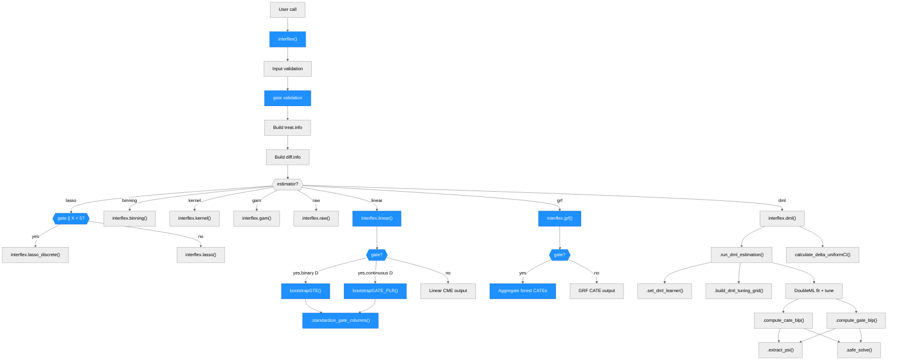
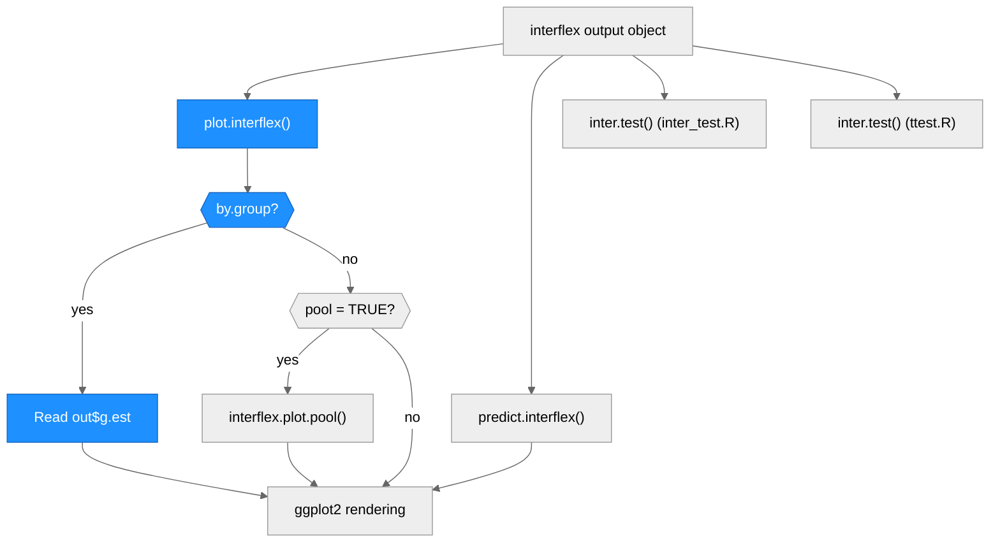
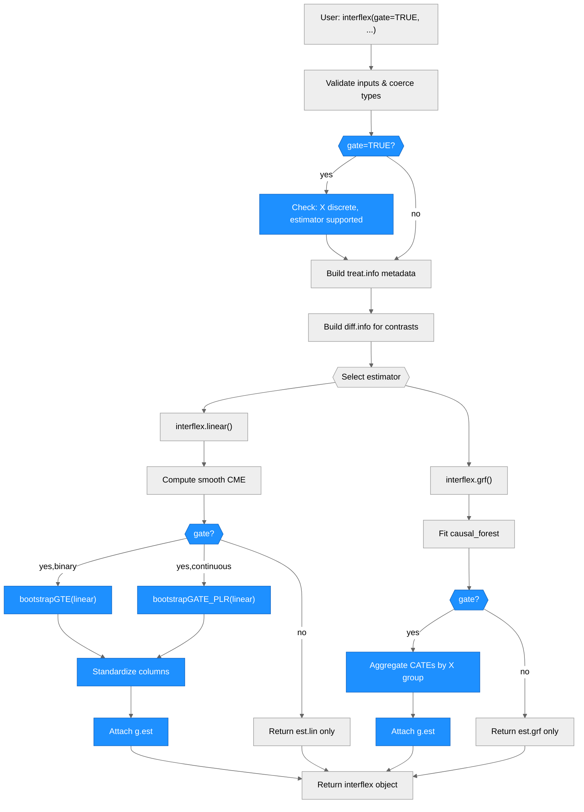

# Architecture — interflex

> Updated by scriber for run `PAD-001` on 2026-04-07.
> Previous runs: `interflex-dml-refactor-20260315-212459` (2026-03-15 — utils.R refactoring), `merge-bs-dml-20260316-032034` (2026-03-16 — merge bs features into dml), `py-to-r-dml-001` (2026-03-16 — Python-to-R DML migration), `REQ-20260403-080941` (2026-04-03 — parallel RNG migration from doParallel to doFuture), `GATE-001` (2026-04-04 — generalize GATE support across estimators), `BOOK-003` (2026-04-07 — plot xlim/ylim coord_cartesian migration, defensive narrow-table helpers, ch6 fit/plot chunk split), `PAD-001` (2026-04-07 — visible xlim padding for continuous-treatment plots via two-pass grid restriction + plot-time row filter).

## Padded-xlim invariant (PAD-001)

For continuous-treatment plots, whenever the user supplies an explicit
`xlim = c(lo, hi)`, the visible curve (mean line, pointwise CI ribbon,
uniform CI bands) and the moderator distribution overlay (density ribbon
or histogram bars) end exactly at `lo`/`hi`, and `coord_cartesian(xlim =
.pad_xlim(xlim, mult = 0.04))` produces ~4% whitespace between those
endpoints and the panel edges. Two independent guarantees enforce this:

- **PASS 1 — fit-time grid restriction.** When `xlim` is passed to
  `interflex(..., xlim = c(lo, hi))` and `treat.type == "continuous"`, the
  prediction grid is built as `seq(lo, hi, length.out = neval)` at every
  continuous-estimator construction site: `R/linear.R`, `R/kernel.R`,
  `R/binning.R`, `R/estimate_cme_plr.R` (lasso PLR path),
  `R/DML.R::.compute_cate_blp` (DML CATE path). A function-local
  `user_xlim_explicit` flag (default `FALSE`) is plumbed as a named
  argument from `interflex.R` through each dispatch — the gate NEVER
  reads from `getOption(...)` inside helper files. Degenerate `xlim`
  (non-finite, `lo >= hi`) falls back to `NULL` with a warning at the
  `interflex.R` validation block. AIPW/IRM is binary-discrete only and
  out of scope; gate plots (`.compute_gate_blp`) and `R/gam.R` (which
  delegates to `mgcv::vis.gam` with its own internal grid) are untouched.

- **PASS 2 — plot-time row filter.** When the user passes `xlim` to
  `plot.interflex(out, xlim = c(lo, hi))` on an `out` object that was
  fit WITHOUT `xlim`, the stored prediction tables still span the full
  data range. `plot.interflex` therefore builds a local filtered shadow
  `.out_filt` immediately after the `.user_xlim_in` snapshot at
  `R/plot.R:198`. The gate `.pad_xlim_gate` fires only when
  `treat.type == "continuous"` AND `.user_xlim_in` is finite, ordered
  length-2. When it fires, `.filter_xlim_rows` drops rows where
  `X < lo - eps | X > hi + eps` (with `eps = 1e-9 * max(1, |hi - lo|)`
  and an empty-keep guard) from every continuous `est.*` field
  (`est.lin`, `est.bin`, `est.kernel`, `est.dml`, `est.lasso`,
  `est.grf`). Downstream continuous branches rebind `est.* <- .out_filt$est.*`
  — the filter therefore covers the mean line, pointwise CI ribbon,
  AND uniform CI bands in a single pass (all three read from the same
  `tempest` data frame). `out` itself is NEVER mutated; `.out_filt`
  is a fresh local.

- **PASS 2b — density/histogram filter.** The Xdistr overlay bars and
  density ribbons extend into the padded whitespace if not filtered.
  Two additional helpers `.filter_xlim_density(dens, lo, hi)` and
  `.filter_xlim_histlike(h, lo, hi)` (also in `R/plot.R`) extend the
  `.out_filt` shadow to cover `out$de` (density: `$x`, `$y`) and
  `out$hist.out` (histogram: `$mids`, `$counts`, `$density`).
  The continuous branches in the `Xdistr == "density"` and
  `Xdistr %in% c("histogram","hist")` blocks of `plot.R` rebind
  `de <- .out_filt$de` and `hist.out <- .out_filt$hist.out` as the
  first statement inside their `if (treat.type == "continuous")`
  sub-block. Histogram bin-width `dist` has a fallback to the
  pre-filter spacing when the filtered hist has <2 mids. Discrete
  Xdistr fields (`out$de.tr`, `out$count.tr`) are intentionally NOT
  filtered.

- **Idempotence.** PASS 1 and PASS 2/2b compose cleanly. When `xlim`
  is supplied to BOTH `interflex()` and `plot()`, PASS 1 has already
  built the grid on `[lo, hi]`, so PASS 2's row filter is a no-op
  on a table whose rows are already inside the window. When `xlim`
  is supplied at plot time only, PASS 1 is silent and PASS 2 does
  the work. When `xlim` is absent at both layers, neither gate
  fires and the behavior is bit-identical to pre-PAD-001.

- **Forbidden paths (preserved).** `.pad_xlim(mult = 0.04)` is
  unchanged. `R/plot_pool.R`'s `coord_cartesian(.pad_xlim(...))`
  call sites are unchanged. No `scale_x_continuous(limits = ...)` or
  `oob = censor` is used anywhere — the 4% whitespace is still
  delivered by `coord_cartesian`, not by scale clipping. Discrete
  branches, gate plots, auto-trim, and `R/gam.R` are untouched.

- **Encoding invariant.** All R source files under `R/` MUST remain
  ASCII-safe unless `DESCRIPTION` declares `Encoding: UTF-8`.
  `pkgload::source_one()` (used by `devtools::load_all` and therefore
  by `devtools::test`) calls `readLines()` without an explicit
  encoding; non-ASCII bytes in the native locale cause
  "unexpected end of input" parse errors even though plain
  `parse()` and `R CMD INSTALL` succeed. See PAD-001 process record.

## Overview

**interflex** is an R package (v1.3.5) for diagnosing and visualizing multiplicative interaction models. It estimates non-linear marginal effects of a treatment (D) on an outcome (Y) across values of a moderator (X), supporting both discrete and continuous treatments. The package provides eight estimation strategies (linear, binning, kernel, GAM, raw, GRF, DML, lasso), unified behind a single `interflex()` entry point. Key external dependencies include ggplot2 (plotting), mgcv (GAM), grf (causal forests), glmnet (lasso/ridge), DoubleML/mlr3 (DML estimation), and Rcpp/RcppArmadillo (C++ linear algebra stubs).

**GATE (Group Average Treatment Effects)**: When `gate = TRUE` is specified with a discrete moderator X, estimators compute group-level average treatment effects instead of (or in addition to) smooth conditional marginal effect curves. GATE is supported by `linear`, `grf`, `dml`, and `lasso` estimators. The unified output field `g.est` holds GATE results across all estimators, with standardized column names (`X`, `ME`, `sd`, `lower CI(95%)`, `upper CI(95%)`).

---

## Module Structure

```mermaid
%%{init: {'theme': 'neutral'}}%%
graph TD
    subgraph API["API Layer"]
        IFX["interflex.R -- router"]
        PLT["plot.R -- S3 plot method"]
        PRD["predict.R -- S3 predict"]
        TST["inter_test.R -- t-tests"]
        TST2["ttest.R -- t-tests (bs)"]
    end

    subgraph Estimators["Estimator Layer"]
        LIN["linear.R"]
        BIN["binning.R"]
        KER["kernel.R"]
        GAM["gam.R"]
        RAW["raw.R"]
        GRF["grf.R"]
        DML["DML.R -- pure R DML"]
        LAS["lasso.R"]
        LSD["lasso_discrete.R"]
    end

    subgraph DMLHelpers["DML Internal Helpers"]
        SDL[".set_dml_learner()"]
        MRF[".map_rf_params()"]
        MBP[".map_boosting_params()"]
        MNP[".map_nn_params()"]
        BTG[".build_dml_tuning_grid()"]
        CCB[".compute_cate_blp()"]
        CGB[".compute_gate_blp()"]
        EPS[".extract_psi()"]
        SSV[".safe_solve()"]
        RDE[".run_dml_estimation()"]
    end

    subgraph DMLSub["DML Sub-Estimators"]
        CME_I["estimate_cme_irm.R"]
        CME_P["estimate_cme_plr.R"]
        GTE_I["estimate_gte_irm.R"]
        GTE_P["estimate_gte_plr.R"]
    end

    subgraph GATEUtils["GATE Utilities"]
        GTU["gate_utils.R"]
    end

    subgraph Output["Output Layer"]
        PPL["plot_pool.R -- pooled plots"]
    end

    subgraph Utils["Utilities"]
        UTL["utils.R -- shared helpers"]
        UNI["uniform.R -- uniform CI"]
        VCL["vcluster.R -- cluster vcov"]
    end

    IFX --> LIN
    IFX --> BIN
    IFX --> KER
    IFX --> GAM
    IFX --> RAW
    IFX --> GRF
    IFX --> DML
    IFX --> LAS
    IFX --> LSD
    PLT --> PPL
    LAS --> CME_I
    LAS --> CME_P
    LAS --> GTE_P
    LSD --> CME_I
    LSD --> GTE_I
    LIN --> UTL
    BIN --> UTL
    KER --> UTL
    GRF --> UTL
    DML --> UTL
    LAS --> UTL
    LSD --> UTL
    RAW --> UTL
    BIN --> VCL
    LIN --> VCL
    KER --> VCL
    DML --> SDL
    DML --> RDE
    RDE --> SDL
    RDE --> CCB
    RDE --> CGB
    RDE --> BTG
    CCB --> EPS
    CGB --> EPS
    CCB --> SSV
    CGB --> SSV
    SDL --> MRF
    SDL --> MBP
    SDL --> MNP
    DML --> UNI
    LIN --> GTE_I
    LIN --> GTE_P
    LIN --> GTU
    GRF --> GTU

    style IFX fill:#1e90ff,stroke:#1565c0,color:#fff
    style LIN fill:#1e90ff,stroke:#1565c0,color:#fff
    style GRF fill:#1e90ff,stroke:#1565c0,color:#fff
    style DML fill:#1e90ff,stroke:#1565c0,color:#fff
    style LSD fill:#1e90ff,stroke:#1565c0,color:#fff
    style PLT fill:#1e90ff,stroke:#1565c0,color:#fff
    style GTU fill:#1e90ff,stroke:#1565c0,color:#fff
```

> One unified diagram. Subgraph layers group related modules. Blue fill = modified in this run (GATE generalization).

### Module Reference

| Module / File | Layer | Purpose | Key Exports | Changed |
| --- | --- | --- | --- | --- |
| `R/interflex.R` | API | Main entry point; validates inputs, builds `treat.info`/`diff.info`, routes to estimator; validates `gate` param | `interflex()` | **yes** |
| `R/plot.R` | API | S3 `plot.interflex()` method; renders marginal effect plots with density/histogram overlays; supports `by.group` via unified `g.est` | `plot.interflex()` | **yes** |
| `R/predict.R` | API | S3 `predict.interflex()` method; computes predicted marginal effects at new X values | `predict.interflex()` | no |
| `R/inter_test.R` | API | Post-estimation t-test for difference in marginal effects (dml style) | `inter.test()` | no |
| `R/ttest.R` | API | Post-estimation t-test for difference in marginal effects (bs copy) | `inter.test()` | no |
| `R/linear.R` | Estimator | Linear interaction model with delta/bootstrap/simulation variance; GATE via `bootstrapGTE`/`bootstrapGATE_PLR` | `interflex.linear()` | **yes** |
| `R/binning.R` | Estimator | Binning estimator: splits X into bins, estimates within-bin effects | `interflex.binning()` | no |
| `R/kernel.R` | Estimator | Kernel estimator: local polynomial regression with bandwidth selection | `interflex.kernel()` | no |
| `R/gam.R` | Estimator | GAM estimator via `mgcv::gam()` with 3D visualization | `interflex.gam()` | no |
| `R/raw.R` | Estimator | Raw data scatter plots with LOESS smoothing | `interflex.raw()` | no |
| `R/grf.R` | Estimator | Generalized random forests via `grf::causal_forest()`; GATE via aggregated forest CATEs | `interflex.grf()` | **yes** |
| `R/DML.R` | Estimator | Pure R DML via DoubleML + mlr3; outputs both `g.est` and `g.est.dml` (deprecated alias) | `interflex.dml()` | **yes** |
| `R/lasso.R` | Estimator | Lasso/ridge DML for continuous moderators; calls CME/GTE sub-estimators | `interflex.lasso()` | no |
| `R/lasso_discrete.R` | Estimator | Lasso/ridge DML for discrete moderators (<5 unique X values); adds `g.est` output field | `interflex.lasso_discrete()` | **yes** |
| `R/gate_utils.R` | GATE Utils | Column name standardization for bootstrap GATE returns to unified format | `.standardize_gate_columns()` | **new** |
| `R/estimate_cme_irm.R` | DML Sub | CME estimation via AIPW-Lasso (binary treatment, IRM) | `estimateCME_IRM()` | no |
| `R/estimate_cme_plr.R` | DML Sub | CME estimation via PO-Lasso (continuous treatment, PLRM) | `estimateCME_PLR()` | no |
| `R/estimate_gte_irm.R` | DML Sub | Group treatment effects via AIPW-Lasso (binary treatment, discrete X); `bootstrapGTE()` | `estimateGTE_IRM()`, `bootstrapGTE()` | no |
| `R/estimate_gte_plr.R` | DML Sub | Group treatment effects via PO-Lasso (continuous treatment, discrete X); `bootstrapGATE_PLR()` | `estimateGATE_PLR()`, `bootstrapGATE_PLR()` | no |
| `R/plot_pool.R` | Output | Pooled multi-treatment plot with overlaid CIs | `interflex.plot.pool()` | no |
| `R/utils.R` | Utils | Shared internal helpers: treat.info extraction, density, histograms | (internal: dot-prefixed) | no |
| `R/uniform.R` | Utils | Uniform confidence interval quantiles via bootstrap/delta method | `calculate_uniform_quantiles()`, `calculate_delta_uniformCI()` | no |
| `R/vcluster.R` | Utils | Cluster-robust variance-covariance matrix computation | `vcovCluster()` | no |
| `R/RcppExports.R` | Utils | Auto-generated Rcpp bindings (do not edit) | `rcpparma_hello_world()`, etc. | no |
| `DESCRIPTION` | Config | Package metadata; Imports, Depends, LinkingTo | N/A | no |
| `NAMESPACE` | Config | Export pattern, S3 methods, importFrom declarations | N/A | no |

---

## Function Call Graph

### Main Pipeline

### Output Pipeline

### Function Reference

| Function | Defined In | Called By | Calls | Changed | Purpose |
| --- | --- | --- | --- | --- | --- |
| `interflex()` | `R/interflex.R` | user (exported) | all estimators | **yes** | Validate inputs (incl. gate), build metadata, route to estimator |
| `plot.interflex()` | `R/plot.R` | user (S3 method) | `interflex.plot.pool()` | **yes** | Render marginal effect or GATE plots; unified `g.est` check |
| `predict.interflex()` | `R/predict.R` | user (S3 method) | ggplot2 | no | Compute and plot predicted marginal effects |
| `inter.test()` | `R/inter_test.R` | user (exported) | mgcv::gam | no | Test differences in marginal effects |
| `interflex.linear()` | `R/linear.R` | `interflex()` | `bootstrapGTE`, `bootstrapGATE_PLR`, `.standardize_gate_columns` | **yes** | Linear interaction model; GATE via bootstrap GTE/GATE_PLR |
| `interflex.grf()` | `R/grf.R` | `interflex()` | `grf::causal_forest`, `predict` | **yes** | GRF CATE; GATE via aggregated forest predictions |
| `interflex.dml()` | `R/DML.R` | `interflex()` | `.run_dml_estimation`, `.compute_cate_blp`, `.compute_gate_blp` | **yes** | Pure R DML; output adds unified `g.est` field |
| `interflex.lasso_discrete()` | `R/lasso_discrete.R` | `interflex()` | `bootstrapGTE`, `bootstrapGATE_PLR` | **yes** | Lasso DML for discrete X; output adds `g.est` field |
| `.standardize_gate_columns()` | `R/gate_utils.R` | `interflex.linear()`, `interflex.grf()` | -- | **new** | Map bootstrap column names to unified GATE format |
| `.run_dml_estimation()` | `R/DML.R` | `interflex.dml()` | `.set_dml_learner`, `.build_dml_tuning_grid`, `.compute_cate_blp`, `.compute_gate_blp` | no | Core DML worker |
| `.compute_cate_blp()` | `R/DML.R` | `.run_dml_estimation` | `.extract_psi`, `.safe_solve`, `splines::bs` | no | CATE via BLP of pseudo-outcomes onto B-spline basis |
| `.compute_gate_blp()` | `R/DML.R` | `.run_dml_estimation` | `.extract_psi`, `.safe_solve` | no | GATE via BLP of pseudo-outcomes onto group dummies |
| `bootstrapGTE()` | `R/estimate_gte_irm.R` | `interflex.linear()`, `interflex.lasso_discrete()` | `estimateGTE`, `glmnet` | no | Bootstrap GTE for binary treatment (IRM framework) |
| `bootstrapGATE_PLR()` | `R/estimate_gte_plr.R` | `interflex.linear()`, `interflex.lasso_discrete()` | `estimateGATE_PLR`, `glmnet` | no | Bootstrap GATE for continuous treatment (PLR framework) |

---

## Data Flow

---

## Key Data Structures

### `treat.info` (built by `interflex()`, consumed by all estimators)

A named list containing treatment metadata. The `.extract_treat_info()` utility unpacks this uniformly.

| Field | When Present | Content |
| --- | --- | --- |
| `treat.type` | always | `"discrete"` or `"continuous"` |
| `other.treat` | discrete | Named character vector of non-base treatment levels |
| `all.treat` | discrete | Named character vector of all treatment levels |
| `base` | discrete | Base treatment level (reference group) |
| `D.sample` | continuous | Named numeric vector of sampled treatment values |
| `ncols` | when set | Number of plot columns |

### `interflex` output object

A list of class `"interflex"` returned by each estimator, containing:

| Field | Content |
| --- | --- |
| `est.lin` / `est.bin` / `est.kernel` / `est.dml` / etc. | Marginal effect estimates data frame |
| `g.est` | **Unified GATE estimates** (when `gate = TRUE`) — named list of data.frames keyed by treatment arm |
| `g.est.dml` | Deprecated alias for `g.est` (DML only, backward compatibility) |
| `dml.models` | Tuned model info: `model.y`, `model.t` (DML only) |
| `dml.losses` | Nuisance losses from DML fit (DML only) |
| `diff.estimate` | Treatment contrast estimates |
| `figure` | ggplot object(s) |
| `hist.out`, `treat.hist`, `de`, `treat_den` | Distribution data for X-axis overlays |
| `treat.info`, `diff.info` | Metadata passed through |

### Unified GATE output columns (`g.est` data.frame)

Each element of `output$g.est` is a data.frame with standardized columns:

| Column | Type | Description |
| --- | --- | --- |
| `X` | numeric | Moderator level |
| `ME` | numeric | Group average treatment effect estimate |
| `sd` | numeric | Standard error |
| `lower CI(95%)` | numeric | Lower pointwise 95% CI |
| `upper CI(95%)` | numeric | Upper pointwise 95% CI |
| `lower uniform CI(95%)` | numeric | Lower uniform 95% CI (when available) |
| `upper uniform CI(95%)` | numeric | Upper uniform 95% CI (when available) |

When `CI = FALSE`, only `X` and `ME` columns are present.

---

## Estimator Architecture

| Estimator | Function | Treatment Type | Moderator Type | Method | Variance | GATE Support |
| --- | --- | --- | --- | --- | --- | --- |
| `"linear"` | `interflex.linear()` | discrete or continuous | continuous | Parametric OLS/GLM with D*X interaction | delta, bootstrap, simulation | **yes** (via bootstrapGTE/bootstrapGATE_PLR) |
| `"binning"` | `interflex.binning()` | discrete or continuous | continuous (binned) | Split X into bins, within-bin linear models | delta, bootstrap, simulation | no |
| `"kernel"` | `interflex.kernel()` | discrete or continuous | continuous | Local polynomial regression, CV bandwidth | bootstrap | no |
| `"gam"` | `interflex.gam()` | continuous only | continuous | `mgcv::gam()` smooth surface | GAM built-in | no |
| `"raw"` | `interflex.raw()` | discrete or continuous | continuous | Scatter + LOESS (no formal estimation) | none | no |
| `"grf"` | `interflex.grf()` | binary | continuous | `grf::causal_forest()` | forest-based | **yes** (via aggregated CATEs) |
| `"dml"` | `interflex.dml()` | discrete or continuous | continuous | R DoubleML + mlr3 cross-fitting with BLP CATE/GATE | HC sandwich + uniform CI | **yes** (via `.compute_gate_blp()`) |
| `"lasso"` | `interflex.lasso()` / `interflex.lasso_discrete()` | binary or continuous | continuous/discrete | PO-Lasso (PLRM) or AIPW-Lasso (IRM) | bootstrap | **yes** (via bootstrapGTE/bootstrapGATE_PLR) |

### GATE Estimation Paths

| Estimator | Binary D | Continuous D | Method |
| --- | --- | --- | --- |
| `linear` | `bootstrapGTE()` with linear nuisance | `bootstrapGATE_PLR()` with linear nuisance | Bootstrap inference, column standardization via `.standardize_gate_columns()` |
| `grf` | Aggregate `causal_forest` CATEs by X group | N/A (GRF is binary-D only) | Forest variance: `SE = sqrt(mean(var_i) / n_group)` |
| `dml` | `.compute_gate_blp()` with IRM pseudo-outcomes | `.compute_gate_blp()` with PLR pseudo-outcomes | HC sandwich variance, uniform CIs |
| `lasso` | `bootstrapGTE()` via `lasso_discrete` | `bootstrapGATE_PLR()` via `lasso_discrete` | Bootstrap inference |

### DML Estimation Pipeline (Pure R)

- `R/DML.R` uses `DoubleML` R package (R6 classes) for core DML estimation
- `mlr3` + `mlr3learners` for ML model backends (ranger, glmnet, lightgbm, nnet)
- `DoubleML::DoubleMLIRM` for binary treatment, `DoubleML::DoubleMLPLR` for continuous
- CATE computed via manual BLP: project pseudo-outcomes onto B-spline basis
- GATE computed via manual BLP: project pseudo-outcomes onto group dummies
- Uniform CIs via existing `calculate_delta_uniformCI()` from `uniform.R`
- Parameter mapping tables translate sklearn names to mlr3/ranger/lightgbm equivalents

### DML Dependencies

| Package | Role | Import Type |
| --- | --- | --- |
| `DoubleML` | Core DML framework (R6 classes: `DoubleMLIRM`, `DoubleMLPLR`) | Imports |
| `mlr3` | ML task framework, `lrn()` for learner creation | Imports |
| `mlr3learners` | Standard learner implementations | Imports |
| `ranger` | Random forest backend (default model) | Imports |
| `data.table` | Required by DoubleML internals | Imports |
| `paradox` | Tuning parameter sets | Imports |
| `mlr3tuning` | Grid search tuning (when CV=TRUE) | Suggests |
| `lightgbm` | Gradient boosting backend (non-default) | Suggests |
| `nnet` | Neural network backend (non-default) | Suggests |

### Parallel RNG Dependencies

| Package | Role | Import Type |
| --- | --- | --- |
| `doFuture` | Future-based foreach backend; registers via `registerDoFuture()` | Imports |
| `doRNG` | Ensures L'Ecuyer-CMRG streams with `.options.future = list(seed = TRUE)` | Imports |
| `future` | Plan-based parallel execution (`plan(multisession)`) | Imports (pre-existing) |
| `parallelly` | `availableCores()` for robust core detection in legacy files | Imports (pre-existing) |

### Dependencies Removed (Previous Runs)

| Package | Reason |
| --- | --- |
| `reticulate` | No longer needed -- all Python code eliminated |
| `inst/python/dml.py` | Deleted -- Python DML engine replaced by R code |

---

## Utility Functions

| Function | Purpose | Used By |
| --- | --- | --- |
| `.extract_treat_info(treat.info)` | Unpacks the `treat.info` list into local variables | 9 files: DML, binning, kernel, linear, grf, lasso, lasso_discrete, raw, inter_test |
| `.compute_density(...)` | Computes kernel density estimates for X-axis distribution overlay | 7 files: DML, binning, kernel, linear, grf, lasso, lasso_discrete |
| `.compute_histograms(...)` | Computes histogram bin counts for X-axis distribution overlay | 7 files: DML, binning, kernel, linear, grf, lasso, lasso_discrete |
| `.standardize_gate_columns(nms, effect_col)` | Maps bootstrap GATE column names to unified format | linear.R, grf.R |

---

## Architectural Patterns

- **Router pattern**: `interflex()` is a monolithic router (~1400 lines) that validates all inputs, builds shared metadata (`treat.info`, `diff.info`), and dispatches to one of 9 estimator functions. Each estimator is a standalone function in its own file.

- **GATE as an orthogonal extension**: GATE support is layered on top of existing estimators via the `gate = TRUE` parameter. Each GATE-capable estimator first computes its normal CME output, then appends `g.est` if gate is requested. This avoids disrupting existing code paths.

- **Unified output contract**: All GATE-capable estimators produce `output$g.est` with identical column schema (`X`, `ME`, `sd`, CIs). The plotting code consumes `g.est` without needing to know which estimator produced it.

- **Column standardization bridge**: Bootstrap functions (`bootstrapGTE`, `bootstrapGATE_PLR`) return columns with different names (`GTE`/`GATE`, `SE`, `CI.lower`). The `.standardize_gate_columns()` helper maps these to the DML-originated format that the plotting code expects.

- **Shared metadata**: `treat.info` and `diff.info` are computed once by the router and passed to every estimator. The `.extract_treat_info()` utility provides uniform unpacking.

- **Inline plotting**: Each estimator builds its own ggplot figure internally rather than delegating to a separate plot function. The S3 `plot.interflex()` method re-renders from stored data.

- **Dot-prefix convention**: Internal helpers use `.` prefix to avoid export via the blanket `exportPattern("^[[:alpha:]]+")` rule.

- **Lasso moderator cardinality split**: The `"lasso"` estimator auto-selects `interflex.lasso_discrete()` when X has fewer than 5 unique values OR when `gate = TRUE` is explicitly set, switching from CME to GTE estimation.

- **Parameter compatibility layer**: The DML estimator accepts sklearn-style parameter names and maps them to R equivalents via `.map_*_params()` helpers.

- **Manual BLP for CATE/GATE**: Since the R DoubleML package lacks `.cate()` and `.gate()` methods, CATE and GATE are computed via Best Linear Projection of pseudo-outcomes onto basis functions, with HC sandwich variance estimation.

- **doFuture parallel backend**: All parallel `foreach` loops use `doFuture::registerDoFuture()` + `future::plan(future::multisession)` with `.options.future = list(seed = TRUE)` for reproducible L'Ecuyer-CMRG parallel RNG streams.

---

## Notes

- **Previous run (refactor, 2026-03-15)**: -506 lines across 21 files. ~500 lines of duplicated code consolidated into `R/utils.R`. ~700 redundant boolean comparisons cleaned.
- **Previous run (bs merge, 2026-03-16)**: 5 files created, 4 files modified. Selectively integrated bs branch features (ttest.R, B-spline expansion, parameter defaults).
- **Previous run (Python-to-R DML migration, 2026-03-16)**: `R/DML.R` completely rewritten (~244 lines old to ~430 lines new). `inst/python/dml.py` deleted (298 lines). Users no longer need Python to use the DML estimator.
- **Previous run (parallel RNG migration, 2026-04-03)**: 7 R files modified (8 parallel blocks). Replaced `doParallel` with `doFuture` for reproducible parallel RNG.
- **Previous run (GATE generalization, 2026-04-04)**: 7 R files modified, 1 new file (`gate_utils.R`), 1 new test file (`test-gate.R` with 49 tests). Generalized GATE support from DML-only to linear, grf, dml, and lasso estimators. Unified output field `g.est` with backward-compatible `g.est.dml` alias. Added input validation for `gate` parameter. Fixed 4 bugs during builder respawn (DML.R encoding, linear.R treatment label mismatch, grf.R column access, lasso_discrete.R type coercion).
- **This run (BOOK-003, 2026-04-07)**: Plot-layer cleanup and ch6 vignette restructure. Files modified: `R/plot.R`, `R/plot_pool.R`, `R/raw.R`, `R/predict.R`, `R/interflex.R`, `vignettes/06_discrete.qmd`, plus new test file `tests/testthat/test-plot-limits.R` (16 tests, all PASS). Three new internal helpers in `R/plot.R`: `.pad_xlim()` (2% symmetric padding for user xlim), `.append_yrange_ci()` (defensive yrange CI column accumulation), `.rename_est_ci()` (defensive colnames assignment for narrow estimator tables). Migrated all `xlim()`/`ylim()`/`scale_*_continuous(limits=)` calls in plot builders to `coord_cartesian()` so visual clipping no longer drops underlying ribbon data. Group-equalization loops in `plot.interflex` and `predict.interflex` collapsed to a single authoritative `coord_cartesian` per panel (one-coord rule). Added user-vs-default sentinel: `interflex()` sets `interflex.user_xlim_explicit` / `interflex.user_ylim_explicit` options at entry (8-line additive block in `R/interflex.R`); `plot.interflex()` reads them, snapshots `.user_xlim_in`/`.user_ylim_in`, and stamps them as attributes on the returned graph for cross-call recovery. This was required because the auto-trim feature added in commit d9b3075 makes raw `xlim` indistinguishable from user input inside `plot.interflex`. ch6 of the Quarto book split nine `dis_out_*` chunks into `ch6-*-fit` (`cache=TRUE`, fit only) + `ch6-*-plot` (`cache=FALSE`, plotting only) pairs, mirroring the ch2 pattern; second-render time drops from ~18 minutes to ~64 seconds (~17x speedup). Three builder respawns were needed: (1) xlim/ylim threading + write-surface expansion to `R/interflex.R`, (2) `.rename_est_ci` helper for narrow-DML colnames defect surfaced by Check 10b, (3) one-character em-dash → `--` cleanup on `R/plot.R:52` to unblock `devtools::load_all` and clear a new `R CMD check` non-ASCII finding. Test-spec was revised mid-run from `ggplot_build($figure)` grob introspection (which inspects the wrapped canvas, not the inner ME plot) to a proper testthat unit-test file using `plot.interflex(out, show.all = TRUE)` to access the raw inner ggplot list `p.group` directly — this is reusable regression coverage for any future plot-layer change.
- **Duplicate ttest files**: Both `R/ttest.R` and `R/inter_test.R` exist and both export `inter.test()`. A future cleanup should remove the duplicate.
- **No formal test suite prior to this run**: The package did not have tests under `tests/` before the DML migration. Test files have been added incrementally.
- **`doRNG` in Imports but unused**: Listed in DESCRIPTION Imports but never called directly via `::`. Minor DESCRIPTION hygiene issue.
