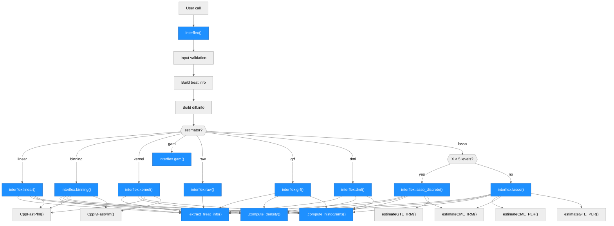
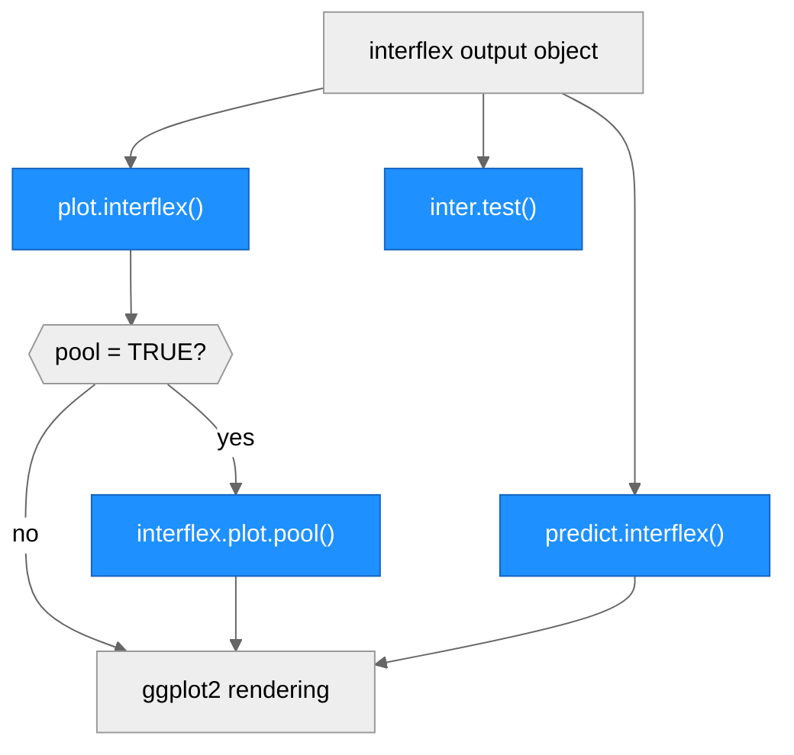
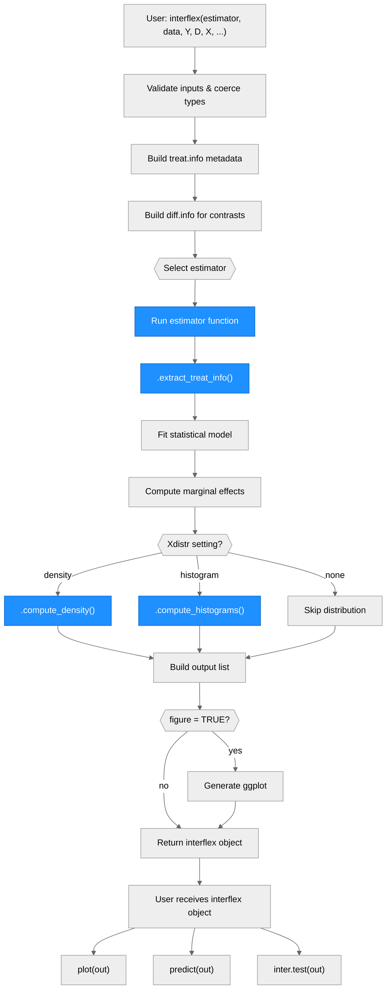

# Architecture — interflex

> Generated by scribe for run `interflex-dml-refactor-20260315-212459` on 2026-03-15.

## Overview

**interflex** is an R package (v1.3.5) for diagnosing and visualizing multiplicative interaction models. It estimates non-linear marginal effects of a treatment (D) on an outcome (Y) across values of a moderator (X), supporting both discrete and continuous treatments. The package provides eight estimation strategies (linear, binning, kernel, GAM, raw, GRF, DML, lasso), unified behind a single `interflex()` entry point. Key external dependencies include ggplot2 (plotting), mgcv (GAM), grf (causal forests), glmnet (lasso/ridge), reticulate (Python DML integration), and Rcpp/RcppArmadillo (C++ fixed-effects backend).

---

## Module Structure

```mermaid
%%{init: {'theme': 'neutral'}}%%
graph TD
    subgraph API["API Layer"]
        IFX["interflex.R — router"]
        PLT["plot.R — S3 plot method"]
        PRD["predict.R — S3 predict"]
        TST["inter_test.R — t-tests"]
    end

    subgraph Estimators["Estimator Layer"]
        LIN["linear.R"]
        BIN["binning.R"]
        KER["kernel.R"]
        GAM["gam.R"]
        RAW["raw.R"]
        GRF["grf.R"]
        DML["DML.R"]
        LAS["lasso.R"]
        LSD["lasso_discrete.R"]
    end

    subgraph DMLSub["DML Sub-Estimators"]
        CME_I["estimate_cme_irm.R"]
        CME_P["estimate_cme_plr.R"]
        GTE_I["estimate_gte_irm.R"]
        GTE_P["estimate_gte_plr.R"]
    end

    subgraph Output["Output Layer"]
        PPL["plot_pool.R — pooled plots"]
    end

    subgraph Utils["Utilities"]
        UTL["utils.R — shared helpers"]
        UNI["uniform.R — uniform CI"]
        VCL["vcluster.R — cluster vcov"]
    end

    subgraph Cpp["C++ Backend"]
        FPM["fastplm.cpp"]
        IVF["iv_fastplm.cpp"]
    end

    IFX --> LIN
    IFX --> BIN
    IFX --> KER
    IFX --> GAM
    IFX --> RAW
    IFX --> GRF
    IFX --> DML
    IFX --> LAS
    IFX --> LSD
    PLT --> PPL
    LAS --> CME_I
    LAS --> CME_P
    LAS --> GTE_P
    LSD --> CME_I
    LSD --> GTE_I
    LIN --> UTL
    BIN --> UTL
    KER --> UTL
    GRF --> UTL
    DML --> UTL
    LAS --> UTL
    LSD --> UTL
    RAW --> UTL
    BIN --> VCL
    LIN --> VCL
    KER --> VCL
    BIN --> FPM
    KER --> FPM
    LIN --> FPM
    BIN --> IVF
    KER --> IVF

    style IFX fill:#1e90ff,stroke:#1565c0,color:#fff
    style UTL fill:#1e90ff,stroke:#1565c0,color:#fff
    style LIN fill:#1e90ff,stroke:#1565c0,color:#fff
    style BIN fill:#1e90ff,stroke:#1565c0,color:#fff
    style KER fill:#1e90ff,stroke:#1565c0,color:#fff
    style GAM fill:#1e90ff,stroke:#1565c0,color:#fff
    style GRF fill:#1e90ff,stroke:#1565c0,color:#fff
    style DML fill:#1e90ff,stroke:#1565c0,color:#fff
    style LAS fill:#1e90ff,stroke:#1565c0,color:#fff
    style LSD fill:#1e90ff,stroke:#1565c0,color:#fff
    style RAW fill:#1e90ff,stroke:#1565c0,color:#fff
    style TST fill:#1e90ff,stroke:#1565c0,color:#fff
    style PLT fill:#1e90ff,stroke:#1565c0,color:#fff
    style PPL fill:#1e90ff,stroke:#1565c0,color:#fff
    style PRD fill:#1e90ff,stroke:#1565c0,color:#fff
    style CME_I fill:#1e90ff,stroke:#1565c0,color:#fff
    style CME_P fill:#1e90ff,stroke:#1565c0,color:#fff
    style GTE_I fill:#1e90ff,stroke:#1565c0,color:#fff
    style GTE_P fill:#1e90ff,stroke:#1565c0,color:#fff
```

### Module Reference

| Module / File | Layer | Purpose | Key Exports | Changed |
| --- | --- | --- | --- | --- |
| `R/interflex.R` | API | Main entry point; validates inputs, builds `treat.info`/`diff.info`, routes to estimator | `interflex()` | yes |
| `R/plot.R` | API | S3 `plot.interflex()` method; renders marginal effect plots with density/histogram overlays | `plot.interflex()` | yes |
| `R/predict.R` | API | S3 `predict.interflex()` method; computes predicted marginal effects at new X values | `predict.interflex()` | yes |
| `R/inter_test.R` | API | Post-estimation t-test for difference in marginal effects at specific X values | `inter.test()` | yes |
| `R/linear.R` | Estimator | Linear interaction model with delta/bootstrap/simulation variance | `interflex.linear()` | yes |
| `R/binning.R` | Estimator | Binning estimator: splits X into bins, estimates within-bin effects | `interflex.binning()` | yes |
| `R/kernel.R` | Estimator | Kernel estimator: local polynomial regression with bandwidth selection | `interflex.kernel()` | yes |
| `R/gam.R` | Estimator | GAM estimator via `mgcv::gam()` with 3D visualization | `interflex.gam()` | yes |
| `R/raw.R` | Estimator | Raw data scatter plots with LOESS smoothing | `interflex.raw()` | yes |
| `R/grf.R` | Estimator | Generalized random forests via `grf::causal_forest()` | `interflex.grf()` | yes |
| `R/DML.R` | Estimator | Double/debiased ML via Python (reticulate); supports cross-fitting | `interflex.dml()` | yes |
| `R/lasso.R` | Estimator | Lasso/ridge DML for continuous moderators; calls CME/GTE sub-estimators | `interflex.lasso()` | yes |
| `R/lasso_discrete.R` | Estimator | Lasso/ridge DML for discrete moderators (<5 unique X values) | `interflex.lasso_discrete()` | yes |
| `R/estimate_cme_irm.R` | DML Sub | CME estimation via AIPW-Lasso (binary treatment, IRM) | `estimateCME_IRM()` | yes |
| `R/estimate_cme_plr.R` | DML Sub | CME estimation via PO-Lasso (continuous treatment, PLRM) | `estimateCME_PLR()` | yes |
| `R/estimate_gte_irm.R` | DML Sub | Group treatment effects via AIPW-Lasso (binary treatment, discrete X) | `estimateGTE_IRM()` | yes |
| `R/estimate_gte_plr.R` | DML Sub | Group treatment effects via PO-Lasso (continuous treatment, discrete X) | `estimateGTE_PLR()` | yes |
| `R/plot_pool.R` | Output | Pooled multi-treatment plot with overlaid CIs | `interflex.plot.pool()` | yes |
| `R/utils.R` | Utils | Shared internal helpers: treat.info extraction, density, histograms | (internal: dot-prefixed) | **new** |
| `R/uniform.R` | Utils | Uniform confidence interval quantiles via bootstrap/delta method | `calculate_uniform_quantiles()`, `calculate_delta_uniformCI()` | no |
| `R/vcluster.R` | Utils | Cluster-robust variance-covariance matrix computation | `vcovCluster()` | no |
| `R/RcppExports.R` | Utils | Auto-generated Rcpp bindings (do not edit) | `CppFastPlm()`, `CppIvFastPlm()` | no |
| `src/fastplm.cpp` | C++ | Fast fixed-effects OLS via Armadillo | `CppFastPlm()` | no |
| `src/iv_fastplm.cpp` | C++ | Fast fixed-effects IV/2SLS via Armadillo | `CppIvFastPlm()` | no |
| `DESCRIPTION` | Config | Package metadata; Imports, Depends, LinkingTo | N/A | yes |
| `NAMESPACE` | Config | Export pattern, S3 methods, importFrom declarations | N/A | no |

---

## Function Call Graph

### Main Pipeline

### Output Pipeline

### Function Reference

| Function | Defined In | Called By | Calls | Changed | Purpose |
| --- | --- | --- | --- | --- | --- |
| `interflex()` | `R/interflex.R` | user (exported) | all estimators | yes | Validate inputs, build metadata, route to estimator |
| `plot.interflex()` | `R/plot.R` | user (S3 method) | `interflex.plot.pool()` | yes | Render marginal effect plots |
| `predict.interflex()` | `R/predict.R` | user (S3 method) | ggplot2 | yes | Compute and plot predicted marginal effects |
| `inter.test()` | `R/inter_test.R` | user (exported) | mgcv::gam | yes | Test differences in marginal effects |
| `interflex.linear()` | `R/linear.R` | `interflex()` | `.extract_treat_info`, `.compute_density`, `.compute_histograms`, `CppFastPlm`, `vcovCluster` | yes | Linear interaction model estimation |
| `interflex.binning()` | `R/binning.R` | `interflex()` | `.extract_treat_info`, `.compute_density`, `.compute_histograms`, `CppFastPlm`, `CppIvFastPlm`, `vcovCluster` | yes | Binning estimator |
| `interflex.kernel()` | `R/kernel.R` | `interflex()` | `.extract_treat_info`, `.compute_density`, `.compute_histograms`, `CppFastPlm`, `CppIvFastPlm`, `vcovCluster` | yes | Kernel estimator |
| `interflex.gam()` | `R/gam.R` | `interflex()` | `mgcv::gam` | yes | GAM-based 3D surface estimation |
| `interflex.raw()` | `R/raw.R` | `interflex()` | `.extract_treat_info` | yes | Raw scatter plots with LOESS |
| `interflex.grf()` | `R/grf.R` | `interflex()` | `.extract_treat_info`, `.compute_density`, `.compute_histograms`, `grf::causal_forest` | yes | Causal forest estimation |
| `interflex.dml()` | `R/DML.R` | `interflex()` | `.extract_treat_info`, `.compute_density`, `.compute_histograms`, `reticulate::source_python` | yes | Python-based DML estimation |
| `interflex.lasso()` | `R/lasso.R` | `interflex()` | `.extract_treat_info`, `.compute_density`, `.compute_histograms`, `estimateCME_PLR`, `estimateCME_IRM`, `estimateGTE_PLR` | yes | Lasso DML for continuous X |
| `interflex.lasso_discrete()` | `R/lasso_discrete.R` | `interflex()` | `.extract_treat_info`, `.compute_density`, `.compute_histograms`, `estimateCME_IRM`, `estimateGTE_IRM` | yes | Lasso DML for discrete X |
| `estimateCME_IRM()` | `R/estimate_cme_irm.R` | `interflex.lasso`, `interflex.lasso_discrete` | `glmnet::cv.glmnet` | yes | CME via AIPW-Lasso (binary D) |
| `estimateCME_PLR()` | `R/estimate_cme_plr.R` | `interflex.lasso` | `glmnet::cv.glmnet` | yes | CME via PO-Lasso (continuous D) |
| `estimateGTE_IRM()` | `R/estimate_gte_irm.R` | `interflex.lasso_discrete` | `glmnet::cv.glmnet` | yes | GTE via AIPW-Lasso (binary D, discrete X) |
| `estimateGTE_PLR()` | `R/estimate_gte_plr.R` | `interflex.lasso` | `glmnet::cv.glmnet` | yes | GTE via PO-Lasso (continuous D, discrete X) |
| `.extract_treat_info()` | `R/utils.R` | 8 estimators + raw | — | **new** | Unpack treat.info list into local variables |
| `.compute_density()` | `R/utils.R` | 7 estimators | `stats::density` | **new** | Compute kernel density estimates |
| `.compute_histograms()` | `R/utils.R` | 7 estimators | `graphics::hist` | **new** | Compute histogram bin counts |
| `vcovCluster()` | `R/vcluster.R` | binning, kernel, linear | `sandwich::estfun`, `sandwich::bread` | no | Cluster-robust variance-covariance |
| `calculate_uniform_quantiles()` | `R/uniform.R` | binning, kernel, linear, lasso | — | no | Bootstrap uniform CI bands |
| `calculate_delta_uniformCI()` | `R/uniform.R` | linear, binning | `MASS::mvrnorm` | no | Delta-method uniform CI bands |
| `CppFastPlm()` | `src/fastplm.cpp` | binning, kernel, linear | — | no | Fast OLS with fixed effects (C++) |
| `CppIvFastPlm()` | `src/iv_fastplm.cpp` | binning, kernel | — | no | Fast 2SLS/IV with fixed effects (C++) |

---

## Data Flow

---

## Key Data Structures

### `treat.info` (built by `interflex()`, consumed by all estimators)

A named list containing treatment metadata. The new `.extract_treat_info()` utility unpacks this uniformly.

| Field | When Present | Content |
| --- | --- | --- |
| `treat.type` | always | `"discrete"` or `"continuous"` |
| `other.treat` | discrete | Named character vector of non-base treatment levels |
| `all.treat` | discrete | Named character vector of all treatment levels |
| `base` | discrete | Base treatment level (reference group) |
| `D.sample` | continuous | Named numeric vector of sampled treatment values |
| `ncols` | when set | Number of plot columns |

### `interflex` output object

A list of class `"interflex"` returned by each estimator, containing:

| Field | Content |
| --- | --- |
| `est.lin` / `est.bin` / `est.kernel` / etc. | Marginal effect estimates data frame |
| `diff.estimate` | Treatment contrast estimates |
| `figure` | ggplot object(s) |
| `hist.out`, `treat.hist`, `de`, `treat_den` | Distribution data for X-axis overlays |
| `treat.info`, `diff.info` | Metadata passed through |
| `model.coef`, `model.vcov` | Model coefficients and variance-covariance (linear, binning) |

---

## Estimator Architecture

| Estimator | Function | Treatment Type | Moderator Type | Method | Variance |
| --- | --- | --- | --- | --- | --- |
| `"linear"` | `interflex.linear()` | discrete or continuous | continuous | Parametric OLS/GLM with D*X interaction | delta, bootstrap, simulation |
| `"binning"` | `interflex.binning()` | discrete or continuous | continuous (binned) | Split X into bins, within-bin linear models | delta, bootstrap, simulation |
| `"kernel"` | `interflex.kernel()` | discrete or continuous | continuous | Local polynomial regression, CV bandwidth | bootstrap |
| `"gam"` | `interflex.gam()` | continuous only | continuous | `mgcv::gam()` smooth surface | GAM built-in |
| `"raw"` | `interflex.raw()` | discrete or continuous | continuous | Scatter + LOESS (no formal estimation) | none |
| `"grf"` | `interflex.grf()` | binary | continuous | `grf::causal_forest()` | forest-based |
| `"dml"` | `interflex.dml()` | discrete or continuous | continuous | Python DML via reticulate cross-fitting | cross-fit |
| `"lasso"` | `interflex.lasso()` | binary or continuous | continuous (>=5 levels) | PO-Lasso (PLRM) or AIPW-Lasso (IRM) | bootstrap |
| `"lasso"` | `interflex.lasso_discrete()` | binary or continuous | discrete (<5 levels) | GTE estimation via IRM or PLR | bootstrap |

### DML Two-Pipeline Architecture

The `"lasso"` estimator routes to sub-estimators based on treatment type and moderator cardinality:

- **Continuous D, continuous X**: `interflex.lasso()` calls `estimateCME_PLR()` (Partially Linear Regression Model)
- **Binary D, continuous X**: `interflex.lasso()` calls `estimateCME_IRM()` (Interactive Regression Model via AIPW)
- **Continuous D, discrete X** (<5 levels): `interflex.lasso_discrete()` calls `estimateGTE_PLR()`
- **Binary D, discrete X** (<5 levels): `interflex.lasso_discrete()` calls `estimateGTE_IRM()`

All four sub-estimators use `glmnet::cv.glmnet()` for regularized nuisance function estimation with basis expansion (polynomial, B-spline, or none).

### Python Integration (DML Estimator)

`interflex.dml()` uses `reticulate` to:
1. Validate the Python script path exists (`nzchar()` check)
2. Source the Python script via `reticulate::source_python()` wrapped in `tryCatch()`
3. Pass data and parameters to Python via `reticulate::dict()`
4. Python performs cross-fitted DML estimation (scikit-learn, econml)
5. Results are returned to R for plotting

---

## C++ Backend

Two Rcpp/RcppArmadillo functions provide fast fixed-effects estimation:

| Function | File | Purpose | Used By |
| --- | --- | --- | --- |
| `CppFastPlm()` | `src/fastplm.cpp` | OLS with high-dimensional fixed effects via Armadillo | binning, kernel, linear |
| `CppIvFastPlm()` | `src/iv_fastplm.cpp` | IV/2SLS with high-dimensional fixed effects | binning, kernel |

These are called when `FE` (fixed effects) or `IV` (instruments) are specified, replacing R's `lm()`/`felm()` for performance.

---

## Utility Functions (New in This Run)

Three internal utility functions in `R/utils.R` consolidate previously duplicated code. They are dot-prefixed (`.extract_treat_info`, `.compute_density`, `.compute_histograms`) to prevent auto-export via the `exportPattern("^[[:alpha:]]+")` rule in NAMESPACE.

| Function | Purpose | Used By | Lines Saved |
| --- | --- | --- | --- |
| `.extract_treat_info(treat.info)` | Unpacks the `treat.info` list into local variables (`treat.type`, `other.treat`, `all.treat`, `base`, `D.sample`, etc.) | 9 files: DML, binning, kernel, linear, grf, lasso, lasso_discrete, raw, inter_test | ~135 lines |
| `.compute_density(data, X, D, weights, treat.type, all.treat, all.treat.origin)` | Computes overall and per-treatment kernel density estimates for the X-axis distribution overlay | 7 files: DML, binning, kernel, linear, grf, lasso, lasso_discrete | ~175 lines |
| `.compute_histograms(data, X, D, weights, treat.type, all.treat, all.treat.origin)` | Computes overall and per-treatment histogram bin counts for the X-axis distribution overlay | 7 files: DML, binning, kernel, linear, grf, lasso, lasso_discrete | ~175 lines |

---

## Architectural Patterns

- **Router pattern**: `interflex()` is a monolithic router (~1400 lines) that validates all inputs, builds shared metadata (`treat.info`, `diff.info`), and dispatches to one of 9 estimator functions. Each estimator is a standalone function in its own file.

- **Shared metadata**: `treat.info` and `diff.info` are computed once by the router and passed to every estimator. The `.extract_treat_info()` utility provides uniform unpacking.

- **Inline plotting**: Each estimator builds its own ggplot figure internally rather than delegating to a separate plot function. The S3 `plot.interflex()` method re-renders from stored data.

- **C++ acceleration for FE models**: Fixed-effects estimation bypasses R's formula interface and uses direct Armadillo matrix operations via Rcpp, critical for large datasets.

- **Dot-prefix convention**: Internal helpers use `.` prefix to avoid export via the blanket `exportPattern("^[[:alpha:]]+")` rule, without requiring explicit `@keywords internal` tags.

- **Lasso moderator cardinality split**: The `"lasso"` estimator auto-selects `interflex.lasso_discrete()` when X has fewer than 5 unique values, switching from CME to GTE estimation.

---

## Notes

- **R CMD check status**: 0 ERRORs, 5 WARNINGs (all pre-existing), 2 NOTEs (all pre-existing). The package installs, loads, and passes namespace checks.
- **Net refactoring impact**: -506 lines across 21 files. ~500 lines of duplicated density/histogram/treat.info code consolidated into `R/utils.R`. ~700 redundant boolean comparisons cleaned.
- **ttest.R removed**: Was an exact duplicate of `inter_test.R`. The `inter.test()` function remains exported from `inter_test.R` with backward-compatible `@rdname ttest.interflex`.
- **GAM formula bug fixed**: Double-loop with shadowed variable in `gam.R` replaced with single loop. FE formula construction also fixed (missing `+` separator).
- **No formal test suite**: The package does not have tests under `tests/`. Validation relies on R CMD check and manual examples.
